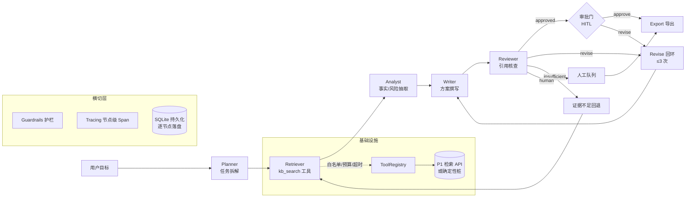

# AgentWorkbench · 企业方案研究与交付多智能体协作系统

基于 **LangGraph 状态机**编排的多智能体工作流系统：给定一个企业业务目标，系统自动完成
**任务规划 → 证据检索 → 事实分析 → 方案撰写 → 评审修订**，支持人工审批门（HITL）、
引用溯源、护栏检查与全链路追踪，最终产出带引用依据的企业方案文档。

[](https://github.com/liuhemingmeng/Enterprise-multi-agent-collaboration/actions/workflows/ci.yml)


> 定位：可复现、可评测、可审计的 LLM 应用工程实践 —— 所有外部依赖（LLM / 检索 API）
> 均通过开关注入，**无密钥时自动回退确定性桩，测试与评测零费用、离线可复现**。

---

## ✨ 功能特性

- **多智能体编排**：Planner / Retriever / Analyst / Writer / Reviewer 五个角色，LangGraph
  `StateGraph` 显式状态机驱动，条件分支（修订回环 / 证据不足回退 / 人工审核 / 直通导出）全部声明式定义
- **引用溯源**：每条方案结论可回溯到检索证据（文档名 / 页码 / 相关度得分），评审节点逐条核查引用
- **人工审批门（HITL）**：评审通过后可暂停等待人工 `approve` / `revise`，也可在修订超限时安全转人工
- **护栏层（Guardrails）**：输入注入检测（critical 阻断）、产物 schema 校验、工具结果注入检测（记录不篡改）
- **工具安全边界**：白名单注册制 + 参数校验 + 超时守卫 + 成本预算 + 错误归档，智能体只能调用已注册工具
- **全链路可观测**：节点级 Span（耗时 / 状态 / 真实 token 与成本）、SSE 实时事件流、护栏审计面板
- **共享密钥鉴权**：与项目一共用一把访问密钥——每个受保护请求**代理到 P1 校验**，
  P1 轮换密钥后本项目零同步即时生效；页面公开、数据接口受保护，写接口带滑动窗口限流
- **持久化与恢复**：SQLite 逐节点落盘，进程重启后从最后完成节点续跑（断点恢复）
- **双模式运行**：真实 API（P1 检索 + 任意 OpenAI 兼容 LLM）与确定性桩一键切换
- **内置评测**：100 条任务数据集，单 Agent vs 多 Agent 对照实验（引用覆盖率 / 自动完成率 / 成本 / 证据数）
- **零构建前端**：单文件工作台（实时节点图 / SSE 进度流 / 人工审批 / Markdown 报告导出）

## 🏗️ 系统架构



每个节点执行都被 `guarded()` 装饰器包裹：先记录 Span（耗时/状态/成本），再跑节点级护栏
（detection-only），节点返回后通过 `graph.stream` 增量落盘 —— 前端轮询即可看到实时进度。

## 🔌 快速开始

### 环境要求

- Python ≥ 3.11
- （可选）真实 LLM API Key —— 任意 OpenAI 兼容端点（DeepSeek / 通义 / 智谱 / OpenAI / 火山方舟）
- （可选）检索服务 API Key —— 缺省时自动使用内置确定性桩

### 安装与运行

```bash
git clone https://github.com/liuhemingmeng/Enterprise-multi-agent-collaboration.git
cd Enterprise-multi-agent-collaboration

python -m venv .venv
source .venv/bin/activate        # Windows: .venv\Scripts\activate
pip install -e ".[test]"

# 配置外部服务（可跳过 —— 无 .env 时自动进入确定性桩模式）
cp .env.example .env             # Windows: copy .env.example .env
# 编辑 .env 填入 RAG_API_KEY / LLM_API_KEY 等

# 启动 API + 工作台前端
uvicorn p2_agent.main:app --host 0.0.0.0 --port 8000
```

浏览器打开 **http://127.0.0.1:8000** —— 提交任务后可实时观察节点图、SSE 进度流、
证据引用、评审意见，并在需要时进行人工审批 / 导出 Markdown 报告。

### Docker

```bash
docker build -t agent-workbench .
docker run -p 8000:8000 --env-file .env agent-workbench
```

## ⚙️ 配置项

| 变量 | 默认 | 说明 |
| --- | --- | --- |
| `P1_RAG_BASE_URL` | 空 | 检索服务地址；留空回退确定性桩 |
| `RAG_API_KEY` | 空 | 检索服务鉴权 Key（`X-API-Key` 头） |
| `P1_RAG_SCORE_THRESHOLD` | `0.3` | 证据相关度阈值，低于则丢弃（过滤低质量召回） |
| `P1_RAG_LIMIT` | `8` | 单次检索返回条数上限 |
| `P1_RAG_TIMEOUT` | `10` | 检索超时（秒） |
| `LLM_BASE_URL` | 空 | OpenAI 兼容 LLM 端点；留空回退确定性桩 |
| `LLM_API_KEY` | 空 | LLM 服务商 Key |
| `LLM_MODEL` | 空 | 模型名（如 `deepseek-chat`） |
| `LLM_TEMPERATURE` | `0.3` | 生成温度（方案写作取偏低值保稳定） |
| `LLM_TIMEOUT` | `120` | 单次 LLM 调用超时（秒）；长文生成需给足 |
| `LLM_MAX_TOKENS` | `2048` | 单次输出 token 上限，控制延迟与成本 |
| `LLM_PRICE_IN_PER_M` | 按模型 | 输入单价（USD / 百万 token），覆盖内置价目表 |
| `LLM_PRICE_OUT_PER_M` | 按模型 | 输出单价（USD / 百万 token） |
| `RATE_LIMIT_ENABLED` | `true` | 写接口限流开关（测试与 CI 自动关闭） |
| `RATE_LIMIT_PER_MINUTE` | `30` | 单客户端每 `RATE_LIMIT_WINDOW_SECONDS` 秒可发起的写请求数 |
| `TRUST_PROXY` | `false` | 是否信任 `X-Forwarded-For`。**仅在服务确实位于可信反向代理之后时才置 `true`**；直连暴露时必须保持 `false`，否则任何客户端都能靠伪造该头获得无限配额 |

双开关逻辑：`RAG_API_KEY` 与 `LLM_API_KEY` 任一缺失，对应组件自动切换到确定性桩，
其余链路（状态机 / 护栏 / 追踪 / 持久化 / 评测）行为完全一致。

## 📡 API 一览

| 方法 | 路径 | 说明 |
| --- | --- | --- |
| `GET` | `/` | 统一入口页（填访问密钥后选择进入 P1 或 P2） |
| `GET` | `/workbench` | 多智能体工作台（页面公开，数据接口需密钥） |
| `GET` | `/health` | 存活检查 |
| `POST` | `/verify-key` | 校验访问密钥是否有效（供入口页使用，带限流） |
| `GET` | `/config` | 外部服务启用状态（不泄露密钥） |
| `POST` | `/tasks` | 提交任务（202 Accepted，后台执行） |
| `GET` | `/tasks/{id}` | 查询任务状态 / 计划 / 证据 / 草稿 / 评审 |
| `POST` | `/tasks/{id}/human-decision` | 人工审批（`approve` / `revise`） |
| `GET` | `/tasks/{id}/events` | 进度事件列表 |
| `GET` | `/tasks/{id}/stream` | SSE 实时流（事件 / Span / 护栏） |
| `GET` | `/tasks/{id}/trace` | 节点级执行追踪（含汇总耗时与成本） |
| `GET` | `/tasks/{id}/guardrails` | 护栏检查结果 |
| `GET` | `/tools` | 工具白名单与预算 |
| `GET` | `/tools/errors` | 工具错误归档 |
| `GET` | `/eval/dataset` | 100 条评测数据集 |
| `POST` | `/eval/run` | 运行单 vs 多 Agent 对照评测（离线桩，零费用） |

## 🛡️ 可靠性设计

| 机制 | 实现 |
| --- | --- |
| 失败安全 | 任何节点异常 → 状态置 `failed` + 错误入档，工作流不产生半成品 |
| 修订回环上限 | Reviewer 判 `revise` 最多重试 3 次，超限安全转人工队列（有限失败保护） |
| 证据不足短路 | 全部检索词已确认无结果时，不再重复检索，直接转人工（不烧预算） |
| 工具预算 | 每任务累计成本超上限后拒绝后续工具调用（`budget_exceeded`） |
| 外部服务重试 | 429 指数退避重试；LLM 解析失败自动回退确定性桩 |
| 断点恢复 | SQLite 逐节点落盘，重启后按 `trace` 最后节点路由续跑 |
| 输入护栏 | 提示注入检测（critical 级直接阻断任务） |

## ⚠️ 失败模式

这一节记录系统**已知会怎么坏**、怎么被发现、以及坏的时候发生什么。
能说出失败边界，比多列几个功能更能说明系统是被认真设计过的。

| 失败类型 | 如何检测 | 发生时的行为 | 是否已验证 |
| --- | --- | --- | --- |
| 单个节点抛异常 | `instrumented` 在异常路径写 `status="error"` 的 Span | 任务置 `failed`，错误入档；不产出半成品草稿 | 单元测试 + 故障注入 |
| 节点烧了 token 后失败 | Span 保留失败前已记录的 `tokens` / `cost_usd` | 花费仍然可见，不会因失败而"隐身" | 单元测试 |
| Reviewer 反复要求修订 | 修订计数器 | 超过 3 次安全转人工队列，不死循环 | 评测集覆盖 |
| 检索无可用证据 | 检索结果为空 / 全部低于阈值 | 短路转人工，不再重复检索烧预算 | 评测集覆盖 |
| 工具预算耗尽 | `CostBudget` 累计 | 拒绝后续工具调用，返回 `budget_exceeded` | 单元测试 |
| 下游 429 / 5xx | HTTP 状态码 | 指数退避重试（0.5s 起，翻倍），重试耗尽抛 `LLMError` | 单元测试 |
| LLM 返回无法解析的内容 | `extract_json` 抛 `ValueError` | 该节点回退确定性桩，任务继续而非中断 | 单元测试 |
| 提示词注入 | 输入护栏关键词/模式检测 | `critical` 级直接阻断任务，不入工作流 | 单元测试 |
| 访问密钥无效 / 过期 | 每次请求代理到 P1 校验 | 返回 401；P1 轮换后旧 key 立即失效 | 线上实测 |
| 客户端洪水 | 进程内滑动窗口计数 | 写接口返回 429 + `Retry-After`（读接口与 SSE 不限流） | 单元测试 |
| **P1 检索服务整体不可用** | 连接超时 / 非 2xx | 回退确定性桩证据，任务继续但证据为桩 | 已设计，未做混沌演练 |

### 已知未覆盖（诚实清单）

- **进程内状态**：Span 与事件存于内存，进程重启后历史追踪丢失（任务状态本身在 SQLite 中持久化，
  可断点续跑）。多实例部署需将 tracing 外部化。
- **限流不跨副本**：计数器是进程内的，扩到 N 个副本后实际限额约为 N 倍。需要 Redis 或网关层限流。
- **任务执行非持久化队列**：运行中任务活在后台线程，进程被 kill 时丢失。生产应迁到 Celery/RQ。
- **无熔断器**：重试能应对瞬时故障，但下游持续不可用时会放大压力。
- **语义层幻觉无自动校验**：引用覆盖率是结构指标，不校验引用内容是否真的支持结论；
  真实性与忠实率评测见项目一，本项目仅保证引用可溯源。

## 📊 评测：单 Agent vs 多 Agent（100 条任务）

`python -m scripts.run_eval`（确定性桩模式，离线、可复现）：

| 指标 | 多 Agent | 单 Agent | 相对变化 |
| --- | --- | --- | --- |
| 自动完成率 | 0.80 | 1.00 | 多 Agent 把修订 / 无证据任务转人工 |
| 安全终止率 | 1.00 | 1.00 | 一致 |
| **引用覆盖率** | **0.90** | **0.30** | **+200%** |
| 单任务成本（模拟计量） | ¥0.04 | ¥0.02 | +100%（多步检索） |
| 平均证据数 | 3.6 | 2.7 | +33% |

**诚实结论**：简单任务单 Agent 更便宜更快；需要检索、审核、人工确认的任务，
多 Agent 的引用覆盖率显著更高、失败处理更可控。多 Agent 的价值不在"更聪明"，
而在**结构化的职责分离带来的可审计性与可控性**。

## 🗂️ 项目结构

```
src/p2_agent/
├── schemas.py          # WorkflowState 状态模型（Pydantic v2，全链路单一状态）
├── graph/workflow.py   # LangGraph 状态机：节点、条件路由、修订回环
├── agents/stubs.py     # 五个智能体节点（桩/真实 LLM 双模式）
├── tools/              # 工具安全边界：白名单、校验、预算、错误归档
│   ├── registry.py     # ToolRegistry（注册制 + 五步执行管线）
│   └── kb_search.py    # kb_search 工具（P1 真实客户端 / 确定性桩同名切换）
├── retrieval.py        # P1 检索客户端（重试 / 阈值过滤 / 字段映射）
├── llm.py              # OpenAI 兼容 LLM 适配器（超时 / max_tokens / 重试 / JSON 抽取）
├── service.py          # 同步工作流服务（graph.stream 增量落盘）
├── async_service.py    # 后台执行器（202 提交 / 事件流 / 人工决策）
├── persistence.py      # SQLite 状态存储
├── tracing.py          # Span / TracingStore（节点级可观测性）
├── guardrails.py       # 三级护栏（输入阻断 / 产物 schema / 工具注入检测）
├── eval/               # 100 条数据集、指标、单/多 Agent 对照
├── events.py           # 进度事件存储
├── settings.py         # 双开关配置装载
└── main.py             # FastAPI 入口 + 前端托管
frontend/index.html     # 零构建单文件工作台（节点图 / SSE / 审批 / 导出）
tests/                  # 134 条测试（工作流 / API / 鉴权 / 限流 / 成本 / 持久化 / 护栏 / 追踪 / 评测回归）
```

## 🧪 开发与质量门禁

```bash
pytest          # 134 条测试：单元 + 集成 + 故障注入 + 100 条评测回归
ruff check src tests
```

CI（GitHub Actions）：push / PR 到 `main` 自动执行 ruff + pytest，评测回归保证行为不漂移。

## 📖 关键设计决策

<details>
<summary><b>为什么用 LangGraph 状态机，而不是自由循环 Agent 或 AutoGen/CrewAI？</b></summary>

企业交付场景需要**可审计的控制流**：每个节点做什么、失败后去哪、何时转人工，必须是显式声明而非
模型自行决定。LangGraph 的条件边让回环 / 回退 / 人工闸门成为一等公民，且状态是强类型 Pydantic 模型，
天然可持久化、可恢复。自由循环 Agent 无法保证终止性和可复现性；AutoGen/CrewAI 更适合对话式协作，
但控制流隐含在框架里，定制审计与断点恢复的成本反而更高。
</details>

<details>
<summary><b>为什么持久化自建 SQLite 存储，而不用 LangGraph 官方 checkpointer？</b></summary>

状态即业务数据：`trace` / 证据 / 评审意见 / 人工决策都在 `WorkflowState` 里，自建
`SQLiteStateStore` 让"断点续跑"（`route_from_checkpoint` 按最后节点路由）与业务查询共用一套存储，
且演示环境零外部依赖。换 PostgreSQL 只需替换 store 实现（接口已隔离）。
</details>

<details>
<summary><b>为什么评测强制离线确定性桩？</b></summary>

评测要回答的是**架构差异**（单 vs 多 Agent 的引用覆盖率 / 终止行为），不是模型能力。
确定性桩消除了 LLM 输出随机性，使对照实验可复现、零费用、可进 CI；真实 API 的端到端
验证由独立的冒烟脚本（`scripts/live_smoke.py`）承担。
</details>

<details>
<summary><b>成本口径是什么？</b></summary>

**两套计量并存，且必须分开看**：

1. **真实 LLM 计量**（`Span.tokens` / `Span.cost_usd`）——LLM 适配器从响应的 `usage` 字段读取
   `prompt_tokens` / `completion_tokens`，按线程隔离累加到所属节点的 Span。
   `GET /tasks/{id}/trace` 汇总出 `total_tokens` / `llm_cost_usd`。
   **token 数是厂商返回的真实值；金额是按配置单价换算的**——单价来自内置价目表，
   可用 `LLM_PRICE_IN_PER_M` / `LLM_PRICE_OUT_PER_M` 覆盖（厂商调价无需改代码）。
2. **工具预算计量**（`CostBudget`）——每个工具声明 `cost_per_call`，按任务累计并在超限时
   拒绝调用。它衡量的是**预算护栏机制本身**，不是账单。

为什么金额要标注为"换算"：很多端点（含订阅制 / Coding Plan）并不按 token 计费，
把换算值说成账单会失真。评测表里 `¥0.04` 那一行属于第 2 类（确定性桩下的模拟计量），
用于对照架构差异，不代表真实花销。
</details>

## 🗺️ 生产化方向

- 任务执行迁移到独立 worker（Celery / RQ）+ 消息队列，API 层无状态水平扩展
- SQLite → PostgreSQL（多写并发），追踪 / 护栏存储外部化（多实例共享）
- OpenTelemetry 导出、Prometheus 指标、SLO 告警
- 租户隔离与细粒度权限（当前为单把共享访问密钥）；密钥接入 KMS 托管
- 限流计数迁到 Redis 或网关层（当前进程内计数，不跨副本）
- 熔断器替代当前"解析失败回退桩"，避免下游持续故障时放大压力

---

本项目为个人学习与求职展示项目，欢迎交流讨论。
